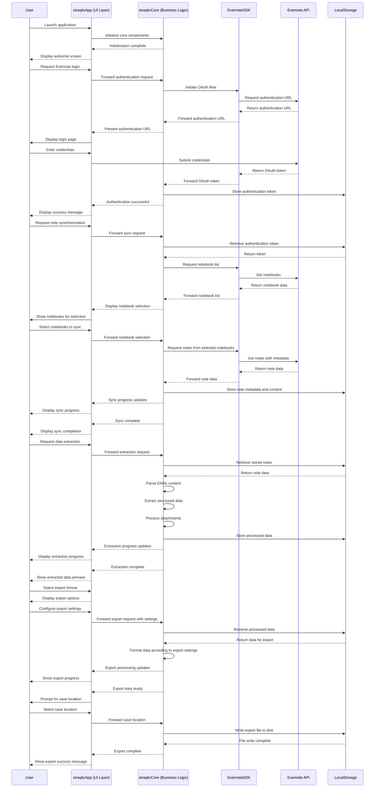

# xtraqtiv Application Flow Sequence Diagram

This diagram illustrates the core interaction flow within the xtraqtiv application, showing how data moves between the user, application layers, Evernote services, and local storage.

This sequence diagram outlines the five main processes within the xtraqtiv application:

1. **App Launch**: Initial startup sequence and component initialization
2. **Authentication Flow**: OAuth-based authentication with Evernote's service
3. **Note Synchronization**: Retrieving notebooks and notes from Evernote 
4. **Data Extraction**: Parsing and structuring note content for analysis
5. **Export Functionality**: Converting extracted data to user-selected formats

The diagram shows the interactions between the UI layer (xtraqtivApp), business logic layer (xtraqtivCore), external services (Evernote SDK and API), and local storage mechanisms.

